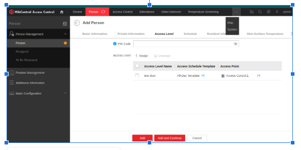
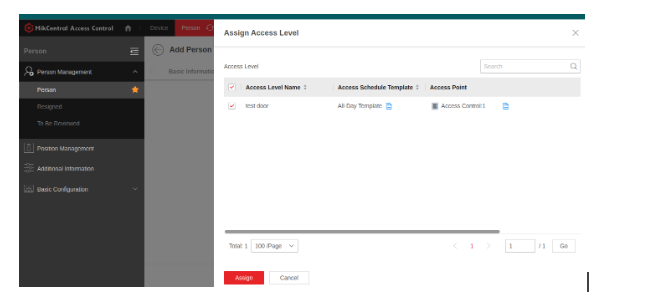
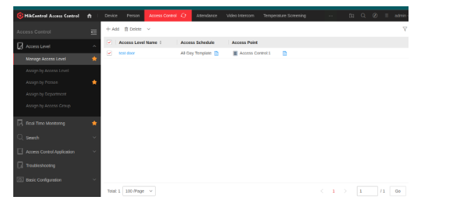
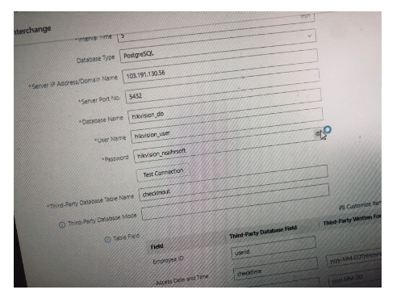
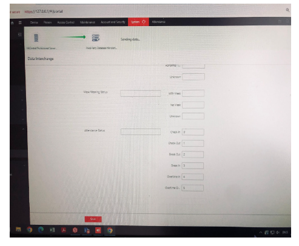
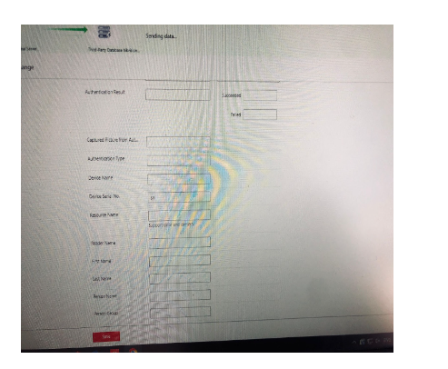
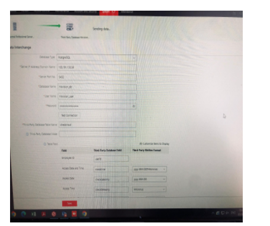
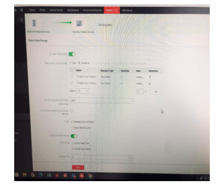

# HikVision Device Configuration on RealHRsoft System


## Overview:

To integrate HikVision devices with the RealHRsoft system, a HikCentral Access Control server is required. This server manages and pushes data to the RealHRsoft system.


### Installation of HikCentral Access Control Server on Windows Server:

- Download and install the HikCentral Access Control server from the official HikVision website.


### PostgreSQL Database Setup for HikVision:


To manage the data centrally, you'll need to set up a PostgreSQL database on your server. Follow these steps:


- **Access PostgreSQL:**


```
sudo su postgres
psql
```


- **Create Database and User:**

```
CREATE DATABASE hikvision_db WITH TEMPLATE = template0 ENCODING = 'UTF8' LOCALE = 'en_US.UTF-8';
ALTER DATABASE hikvision_db OWNER TO hikvision_user;
GRANT ALL ON DATABASE hikvision_db TO hikvision_user;
ALTER USER hikvision_user LOGIN;
```


- **Connect to the Database:**

```
\connect hikvision_db
SET statement_timeout = 0;
SET lock_timeout = 0;
SET idle_in_transaction_session_timeout = 0;
SET client_encoding = 'UTF8';
SET standard_conforming_strings = on;
SELECT pg_catalog.set_config('search_path', '', false);
SET check_function_bodies = false;
SET xmloption = content;
SET client_min_messages = warning;
SET row_security = off;
```


- **Create Table for Access Control Data:**


```
CREATE TABLE public.checkinout (
    id integer NOT NULL,
    userid integer NOT NULL,
    checktime timestamp without time zone NOT NULL,
    checkdateonly date NOT NULL,
    checktimeonly time without time zone NOT NULL,
    checktype integer DEFAULT 1 NOT NULL,
    verifycode integer DEFAULT 1,
    sn character varying(20) NOT NULL,
    CONSTRAINT checktype_valid CHECK ((checktype = ANY (ARRAY[0, 1, 2, 3, 4, 5, 8, 9]))),
    CONSTRAINT verifycode_valid CHECK ((verifycode = ANY (ARRAY[0, 1, 2, 9])))
);
ALTER TABLE public.checkinout OWNER TO hikvision_user;
```


- **Create Sequence for the Table:**

```
CREATE SEQUENCE public.checkinout_id_seq
    AS integer
    START WITH 1
    INCREMENT BY 1
    NO MINVALUE
    NO MAXVALUE
    CACHE 1;

ALTER TABLE public.checkinout_id_seq OWNER TO hikvision_user;
ALTER SEQUENCE public.checkinout_id_seq OWNED BY public.checkinout.id;
ALTER TABLE ONLY public.checkinout ALTER COLUMN id SET DEFAULT nextval('public.checkinout_id_seq'::regclass);
ALTER TABLE ONLY public.checkinout
    ADD CONSTRAINT checkinout_pkey PRIMARY KEY (id);
GRANT ALL ON TABLE public.checkinout TO hikvision_user;
GRANT SELECT, USAGE ON SEQUENCE public.checkinout_id_seq TO hikvision_user;
```


### Environment Configuration:


- Add the following configuration to your .env file:

```
USING_HIK_CENTRAL='True'
HIK_DIRECT='hik_direct'
HIK_DIRECT_DATABASE_NAME='hikvision_db'
HIK_DIRECT_DATABASE_USER='hikvision_user'
HIK_DIRECT_DATABASE_PASSWORD='hikvision_realhrsoft'
HIK_DIRECT_DATABASE_HOST='127.0.0.1'
HIK_DIRECT_DATABASE_PORT='5432'
```


### PostgreSQL Configuration:


- Update the PostgreSQL configuration files to allow external connections:


- **Edit postgresql.conf:**

```
sudo vi /etc/postgresql/<version>/main/postgresql.conf
```


- set:

```
listen_addresses = '*'
port = 5432
```


- **Edit pg_hba.conf:**

```
sudo vi /etc/postgresql/<version>/main/pg_hba.conf
```


- Add the following line:

```
host  all  all  0.0.0.0/0  md5
```


### Setup Process:


- **Adding User:**

    - Add users to HikCentral Access Control as per your system's requirements.

--  


- **Assigning User in Access Control:**

    - Assign the created users to appropriate access control lists.

--  

--  


--  


- **Adding Table Fields for Access:**

    - Customize the checkinout table fields if necessary to accommodate additional data points required by your system.


--  


--  


--  


--  


--  


